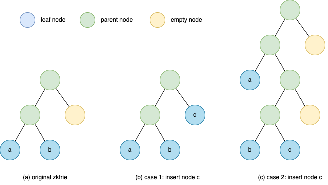
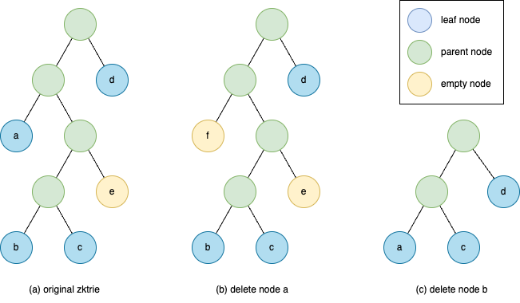

# Operation

## Insertion

<figure>

<figcaption align = "center"><b>Figure 2. Insert a new leaf node to zkTrie</b></figcaption>
</figure>

When we insert a new leaf node to the existing zkTrie, there could be two cases illustrated in the Figure 2.

1. When traversing the path of the node key, it reaches an empty node (Figure 2(b)). 
   In this case, we just need to replace this empty node by this leaf node and backtrace the path to update 
   the merkle hash of parent nodes till the root.
2. When traversing the path of the node key, it reaches another leaf node `b` (Figure 2(c)). 
   In this case, we need to push down the existing leaf node `b` until the next bit in the node keys of two leaf 
   nodes differs. At each push-down step, we need to insert an empty sibling node when necessary. 
   When we reach the level where the bits differ, we then place two leaf nodes `b` and `c` as the left child and 
   the right child depending on their bits. At last, we backtrace the path and update the merkle hash of all 
   parent nodes.

## Deletion

<figure>

<figcaption align = "center"><b>Figure 3. Delete a leaf node from the zkTrie</b></figcaption>
</figure>

The deletion of a leaf node is similar to the insertion. There are two cases illustrated in the Figure 3.

1. The sibling node of to-be-deleted leaf node is a parent node (Figure 3(b)). In this case, we can just replace the 
   node `a` by an empty node and update the node hash of its ancestors till the root node.
2. The node of to-be-deleted leaf node is a leaf node (Figure 3(c)). Similarly, we first replace the leaf node by 
   an empty node and start to contract its sibling node upwards until its sibling node is not an empty node. 
   For example, in Figure 3(c), we first replace the leaf node `b` by an empty node. During the contraction, since 
   the sibling of node `c` now becomes an empty node, we move node `c` one level upward to replace its parent node. 
   The new sibling of node `c`, node `e`, is still an empty node. So again we move node `c` upward. 
   Now that the sibling of node `c` is node `a`, the deletion process is finished.

Note that the sibling of a leaf node in a valid zkTrie cannot be an empty node. Otherwise, we should always prune the subtree and move the leaf node upwards.
