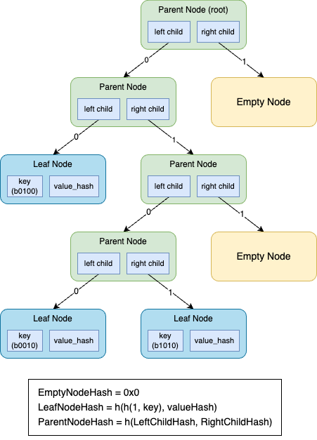

# Tree Structure

<figure>

<figcaption align = "center"><b>Figure 1. zkTrie Structure</b></figcaption>
</figure>

As illustrated in the Figure 1, there are three types of nodes in the zkTrie.
- Parent Node (type: 0): Given the zkTrie is a binary tree, a parent node has two children.
- Leaf Node (type: 1): A leaf node holds the data of a key-value pair.
- Empty Node (type: 2): An empty node is a special type of node, indicating the sub-trie that shares the same prefix is empty.

A zkTrie needs a hash scheme to compute the node hash.
In our implementation, we provide Poseidon hash scheme.
Other hash schemes can be used as well, but Poseidon hash is more friendly and efficient to prove it in the zk circuit.
